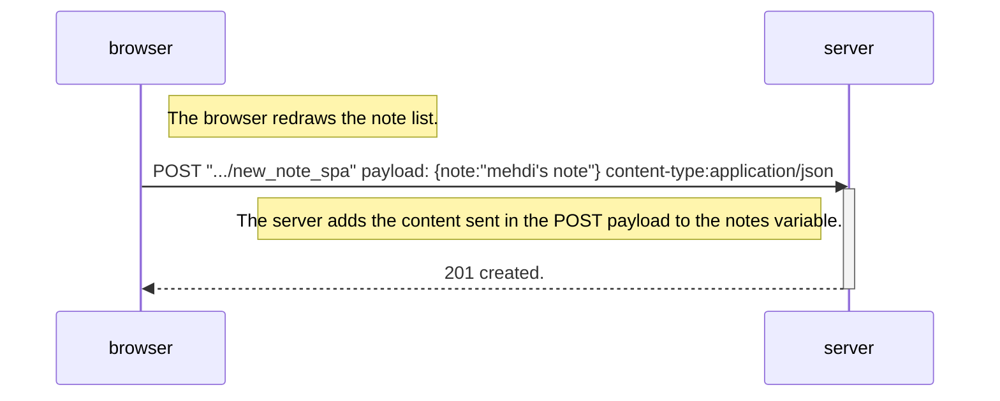

```mermaid
  sequenceDiagram
    participant browser
    participant server

    Note right of browser: The browser redraws the note list.
    browser->>server: POST ".../new_note_spa" payload: {note:"mehdi's note"} content-type:application/json
    activate server
    Note left of server: The server adds the content sent in the POST payload to the notes variable.
    server-->>browser: 201 created.
    deactivate server

```
